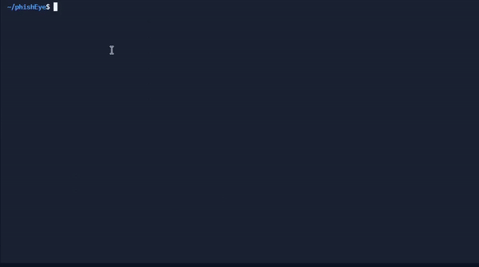

<!-- phishEye -->

<p align="center">
  
</p>

</p>

<p align="center">
  
  
  
</p>

<p align="center">A beginners friendly, Automated phishing tool</p>

<p align="center"><strong>phishEye</strong> is a ultimate phishing tool in python. Includes popular websites like Facebook, Twitter, Instagram, LinkedIn, GitHub, Dropbox, and many others. Created with Flask and custom templates and tunneled with ngrok.</p>

<h3><p align="center">Disclaimer</p></h3>

<i>Any actions and or activities related to <b>phishEye</b> is solely your responsibility. The misuse of this toolkit can result in <b>criminal charges</b> brought against the persons in question. <b>The contributors will not be held responsible</b> in the event any criminal charges be brought against any individuals misusing this toolkit to break the law.

<b>This toolkit contains materials that can be potentially damaging or dangerous for social media</b>. Refer to the laws in your province/country before accessing, using, or in any other way utilizing this in a wrong way.

<b>This Tool is made for educational purposes only</b>. Do not attempt to violate the law with anything contained here. <b>If this is your intention, then Get the hell out of here</b>!

It only demonstrates "how phishing works". <b>You shall not misuse the information to gain unauthorized access to someone's social media</b>. However, you may try out this at your own risk.</i>

### Features

- Latest and updated login pages.
- Beginners friendly
- Auto install all required modules
- Multiple tunneling options
  - Localhost
  - Ngrok
- Phishing short url ( i.e.: https://m.facebook.com@is.gd/dyoOj9 )
- Victim information (like, IP,user-agent,continent,country,region name,city,district,zip code,latitude-longitude and ISP)

### Requirements

**`phishEye`** requires the following programs to run properly - 
- `python3`
- `pip3`

### Installation

- Just, Clone this repository -
```
$ git clone https://www.github.com/sky9262/phishEye.git
```

- Change to the cloned directory -
```
$ cd phishEye
```

- Now run `phishEye.py` -
```
$ python3 phishEye.py
```

### Install required modules if auto-install is not working
- Install required modules to run `phishEye.py` -
```
$ pip3 install -r requirements.txt
```


## Usage
- By running `python3 phishEye.py`, you will be provided to choose options.
- **OR**
- You can run it in one line `python3 phishEye.py -s facebook -d pc -p 4444`
- **Note:** Username/Password will be saved in captured.db

### Here `-s`, `-d` and `-p` are options :
- `-s` --> site name (from <a href="https://github.com/sky9262/phishEye#:~:text=%3A%3A%20Workflow%20%3A%3A-,Available%20sites,-Click%20me%20to">available sites</a>) **(Default: facebook)**
- `-d` --> device (like, PC or MOBILE) **(Default: PC)**
- `-p` --> port number **(Default: 4444)**

<h3 align="center">
:: Workflow ::
</h3>
<p align="center">

</p>

## Available sites
<details>
<summary>Click me to view sites</summary><blockquote>
<details>
<summary>PC</summary>
<ol>

[1] Amazon
  
[2] DeviantArt
  
[3] Dropbox
  
[4] eBay
  
[5] Facebook
  
[6] Github
  
[7] GitLab
  
[8] Google
  
[9] Instagram
  
[10] LinkedIn
  
[11] Messenger
  
[12] PayPal
  
[13] Twitter
  
</ol>
</details>  
<details>
<summary>MOBILE</summary>
<ol>
  
[1] Amazon
  
[2] DeviantArt
  
[3] Dropbox
  
[4] eBay
  
[5] Facebook
  
[6] Github
  
[7] GitLab
  
[8] Google
  
[9] Instagram
  
[10] LinkedIn
  
[11] PayPal
  
[12] Twitter 

</ol>
</details>
</details>

<a href="https://sky9262.tistory.com/entry/phishEye-An-ultimate-phishing-tool#:~:text=Wanna%20go%20more%20advanced%3F">
<p align=center>
  <a href="https://github.com/sky9262"></a>
</p>
  
### Thanks! Feel free to contribute.
